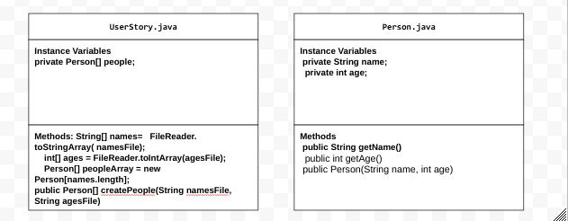

# Unit 2 - Data for Social Good Project

## Introduction

Software engineers develop programs to work with data and provide information to a user. Each user has different needs based on the information they are looking for from data. Your goal is to create a data analysis program for your user that stores and analyzes data to provide the information they need.

## Requirements

Use your knowledge of object-oriented programming, one-dimensional (1D) arrays, and algorithms to create your data analysis program:
- **Write a class** – Write a class to represent your user or business and store and analyze their data with no-argument and parameterized constructors.
- **Create at least two 1D arrays** – Create at least two 1D arrays to store the data that your user needs information about.
- **Write a method** – Write a method that finds or manipulates the elements in a 1D array to provide the information your user needs.
- **Implement a toString() method** – Write a toString() method that returns general information about the data (for example, number of values in the dataset).
- **Document your code** – Use comments to explain the purpose of the methods and code segments and note any preconditions and postconditions.

## User Story 
 

> As a soccer player,   
> I want to find out the right age to try to become pro and how many people are already in the industry,   
> so that I can not waste any time and not rush to go pro; find the right age. I also want to see how many people are currently playing to see the posibility of getting recruited.

## Dataset 

Dataset: https://www.kaggle.com/datasets/oles04/bundesliga-soccer-player 
- **Name** (String) - name of the players 
- **Ages** (int) - Ages of all the players 

## UML Diagram 

 

## Description 

My project consisted of various methods, 1D arrays, private instance variables, gettermethods, and more. Since my user story was a soccer player wanted to learn more about becoming professional, I decided to make my app print out the average age of the players and the total amount of players. In order to get this information, I used a data set from kaggle which included,names,ages,positions,height,etc. 
